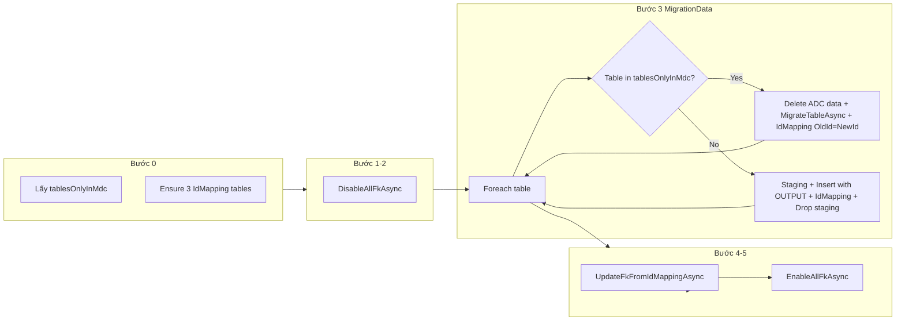

# Plan: IdMapping + Staging + FK flow trong RunDataSync

## Tổng quan luồng

---

## 1. Tạo 3 bảng IdMapping (3.1)

**File mới:** [IdMappingSetup.cs](d:\LOGISTIC\SourceTools\Logistics.DbMerger\IdMappingSetup.cs) (hoặc method trong Program.cs).

- **CreateIdMappingTablesIfNotExistsAsync(SqlConnection targetConn)**  
Tạo 3 bảng trên ADC (chỉ khi chưa tồn tại):
  - **IdMappingInt:** `TableName` NVARCHAR(128), `ColumnName` NVARCHAR(128), `OldId` INT, `NewId` INT, `MigrationBatch` NVARCHAR(64), `TenantId` INT NULL, `CreatedDate` DATETIME2(2) DEFAULT SYSDATETIME().  
  Index: `(TableName, OldId)` INCLUDE (NewId, ColumnName); (MigrationBatch, TableName); (TenantId, TableName) WHERE TenantId IS NOT NULL.
  - **IdMappingBigInt:** Cấu trúc giống, `OldId`/`NewId` BIGINT.
  - **IdMappingGuid:** Cấu trúc giống, `OldId`/`NewId` UNIQUEIDENTIFIER.
- Menu: thêm option (vd. "Create IdMapping tables") gọi method trên; hoặc gọi tự động ở đầu RunDataSync (Bước 0) khi không dryRun.

**Tham chiếu:** DDL mẫu bạn cung cấp (đổi tên bảng và kiểu OldId/NewId cho từng bảng).

---

## 2. Disable / Enable FK (3.2, 3.5)

**File mới:** [FkConstraintHelper.cs](d:\LOGISTIC\SourceTools\Logistics.DbMerger\FkConstraintHelper.cs).

- **DisableAllFkAsync(SqlConnection conn)**  
  - Query: `sys.foreign_keys` (parent_object_id, name) cho schema dbo (hoặc toàn DB).  
  - Với mỗi FK: `ALTER TABLE [schema].[parent_table] NOCHECK CONSTRAINT [fk_name]`.  
  - Dùng `OBJECT_SCHEMA_NAME(parent_object_id)` và `OBJECT_NAME(parent_object_id)` để build tên bảng.
- **EnableAllFkAsync(SqlConnection conn)**  
  - Cùng danh sách FK.  
  - `ALTER TABLE [schema].[parent_table] WITH CHECK CHECK CONSTRAINT [fk_name]`.
- Lưu danh sách FK (tên constraint, parent table) khi disable để enable đúng thứ tự (hoặc query lại khi enable).

---

## 3. Lấy danh sách "table chỉ có ở MDC" và PK (phục vụ 3.3)

- **Bước 0 – Đầu RunDataSync (trước mọi Schema Sync):**  
Gọi **Helper.GetTablesOnlyInMdcAsync(sourceConn, targetConn, outputFilePath: null)**.  
Hiện tại Helper luôn ghi file: có thể thêm overload không ghi file (chỉ return list) hoặc truyền path tạm.  
Lưu kết quả vào `HashSet<string> tablesOnlyInMdc` (case-insensitive) để dùng trong Bước 3.
- **PK column cho từng bảng:**  
Cần biết (TableName, PkColumnName, PkDataType) để:  
  - Tạo staging (cột OldId đúng kiểu).  
  - Chọn IdMappingInt / IdMappingBigInt / IdMappingGuid.
  **Method mới (vd. trong DataMigrator hoặc SchemaSync):**  
  **GetPkColumnInfoAsync(SqlConnection conn, string tableName)**  
  - Query `sys.indexes` (is_primary_key=1) + `sys.index_columns` + `sys.columns` + `sys.types` cho bảng, lấy cột PK đầu tiên (key_ordinal=1).  
  - Trả về (ColumnName, DataType) — giả định single-column PK; nếu composite thì lấy cột đầu hoặc quyết định quy ước (vd. chỉ hỗ trợ PK 1 cột).  
  - DataType chuẩn hóa: int, bigint, uniqueidentifier để map sang 3 bảng IdMapping.

---

## 4. MigrationData (3.3) – Insert có IdMapping + Staging

**Chỗ gọi:** Trong [Program.cs](d:\LOGISTIC\SourceTools\Logistics.DbMerger\Program.cs) RunDataSync, sau khi đã có `orderedTables`, `existingAdcTables`, `tablesOnlyInMdc`, và đã Sync Schema cho từng bảng (giữ nguyên logic hiện tại). Khi `!dryRun`, thay vì chỉ gọi `MigrateTableAsync` trong vòng lặp, thực hiện luồng dưới đây.

**4.1 – Tạo migrationBatch**  
`string migrationBatch = Guid.NewGuid().ToString("N");` (hoặc format bạn chọn).

**4.2 – Foreach table (theo orderedTables, có skip sysdiagrams/Tenants/Users/__*):**

- Áp dụng **ExplicitTableMappings** và **fuzzy match** để có `targetTable` (giống hiện tại).  
- **Nếu bảng thuộc tablesOnlyInMdc:**
  - Trên ADC: **xóa hết data** bảng đích — `TRUNCATE TABLE [dbo].[targetTable]` (hoặc DELETE nếu muốn tránh TRUNCATE với FK disabled).  
  - Gọi **MigrateTableAsync**(sourceTableName, isNewTable: false, targetTableName, sourceTenantId, targetTenantId, userMapping) — giữ KeepIdentity.  
  - Ghi IdMapping: với mỗi row vừa insert (hoặc đọc lại từ target), OldId = NewId. Cách đơn giản: đọc từ **source** danh sách Id (SELECT Id FROM [sourceTable] WHERE ...), với mỗi Id insert vào IdMapping tương ứng (Int/BigInt/Guid) với OldId = NewId = Id, TableName = targetTable, ColumnName = PK name, MigrationBatch, TenantId.  
  - Không dùng staging; không drop gì.
- **Nếu bảng không thuộc tablesOnlyInMdc (bảng có cả MDC và ADC từ đầu):**
  - **Staging = Source schema + OldId** (đúng thiết kế hình):  
  Cấu trúc: **OldId** (kiểu trùng PK nguồn) + mọi cột nguồn **trừ** cột PK (Id).  
  Tên: `**[targetTable]_staging`** (trên ADC).
  - **Tạo staging:**  
  Build `CREATE TABLE [dbo].[targetTable_staging] (...)` từ metadata nguồn: lấy source columns (GetSourceColumnSchemasAsync hoặc tương đương), bỏ cột PK, thêm cột OldId với kiểu = kiểu PK nguồn (từ GetPkColumnInfoAsync).  
  Execute CREATE TABLE trên targetConn.
  - **Copy theo batch:**  
    - Đọc từ MDC theo batch (vd. _batchSize): SELECT Id AS OldId, col1, col2, ... (các cột không phải Id) FROM [sourceTable] + whereClause.  
    - BulkCopy hoặc Insert từng batch vào `[targetTable]_staging` trên ADC.
  - **Insert từ staging vào bảng đích + OUTPUT NewId:**  
    - Dùng MERGE hoặc INSERT...OUTPUT:  
    MERGE [dbo].[targetTable] AS t  
    USING [dbo].[targetTable_staging] AS s ON 1=0  
    WHEN NOT MATCHED THEN INSERT (col1, col2, ...) VALUES (s.col1, s.col2, ...)  
    OUTPUT s.OldId, inserted.Id AS NewId;  
    - Hoặc INSERT INTO [targetTable] (col1, col2, ...) OUTPUT inserted.Id SELECT col1, col2, ... FROM staging — khi đó cần thêm cách ghép cặp (OldId, NewId) (vd. dùng ROW_NUMBER hoặc temp table có OldId + dữ liệu). Cách sạch: MERGE với OUTPUT s.OldId, inserted.Id.
  - **Ghi IdMapping:** Từ result set (OldId, NewId), INSERT vào IdMappingInt / IdMappingBigInt / IdMappingGuid (chọn bảng theo GetPkColumnInfoAsync), với TableName = targetTable, ColumnName = PK column name, MigrationBatch, TenantId, CreatedDate.
  - **Drop staging:** `DROP TABLE [dbo].[targetTable]_staging]`.

**4.3 – Xử lý bảng không có PK / không identity**  
Nếu bảng không có PK hoặc PK không phải int/bigint/uniqueidentifier: có thể bỏ qua IdMapping cho bảng đó hoặc chỉ dùng MigrateTableAsync (BulkCopy) không ghi IdMapping; cần quy ước rõ trong code (vd. chỉ map khi PK type là int/bigint/uniqueidentifier).

**4.4 – TenantId trong IdMapping**  
Khi có filter tenant (sourceTenantId/targetTenantId), truyền targetTenantId (hoặc sourceTenantId tùy quy ước) vào cột TenantId của IdMapping; khi không filter để NULL.

---

## 5. UpdateFkFromIdMappingAsync (3.4)

**Method:** Trong FkConstraintHelper hoặc file riêng (vd. [UpdateFkFromIdMapping.cs](d:\LOGISTIC\SourceTools\Logistics.DbMerger\UpdateFkFromIdMapping.cs)).

- **UpdateFkFromIdMappingAsync(SqlConnection targetConn, string migrationBatch, int? tenantId)**  
  - **5.1** Lấy danh sách FK: query `sys.foreign_keys` + `sys.foreign_key_columns` để có (ChildTable, ChildColumn, ReferencedTable, ReferencedColumn). Chỉ lấy FK trong schema dbo (hoặc toàn DB tùy quy ước).  
  - **5.2** Với mỗi FK: lấy kiểu dữ liệu của **ChildColumn** (hoặc ReferencedColumn) từ sys.columns + sys.types.  
  - **5.3** Chọn bảng map: int → IdMappingInt, bigint → IdMappingBigInt, uniqueidentifier → IdMappingGuid.  
  - **5.4** Build và thực thi UPDATE:  
  `UPDATE [dbo].[ChildTable] SET [ChildColumn] = m.NewId FROM [dbo].[ChildTable] c INNER JOIN [dbo].[IdMappingXXX] m ON m.TableName = @ReferencedTable AND m.ColumnName = @ReferencedColumn AND c.[ChildColumn] = m.OldId WHERE m.MigrationBatch = @Batch AND (m.TenantId = @TenantId OR (@TenantId IS NULL AND m.TenantId IS NULL)).`  
  - **5.5** Log số dòng affected hoặc lỗi (vd. 0 rows khi không có map tương ứng).

---

## 6. Thứ tự thực thi trong RunDataSync (tích hợp)

Thứ tự gợi ý trong [Program.cs](d:\LOGISTIC\SourceTools\Logistics.DbMerger\Program.cs) RunDataSync (khi !dryRun):

1. **Đầu tiên (trước Schema Sync):** Gọi `GetTablesOnlyInMdcAsync(sourceConn, targetConn)` (hoặc overload không ghi file), lưu vào `tablesOnlyInMdc`.
2. Giữ nguyên: resolve tenant, SyncUsersAsync, lấy existingAdcTables, sourceTables, orderedTables, và **Schema Sync** (SyncTableSchemaAsync) cho từng bảng như hiện tại.
3. **Ensure IdMapping:** Gọi CreateIdMappingTablesIfNotExistsAsync(targetConn).
4. **Disable FK:** DisableAllFkAsync(targetConn).
5. **migrationBatch =** Guid.NewGuid().ToString("N").
6. **Foreach table** (cùng vòng lặp orderedTables, sau khi đã sync schema cho bảng đó):
  - Nếu trong tablesOnlyInMdc: TRUNCATE/DELETE bảng đích → MigrateTableAsync → ghi IdMapping (OldId = NewId).  
  - Ngược lại: tạo staging (source schema + OldId), copy batch MDC → staging, insert từ staging vào target + OUTPUT, ghi IdMapping, DROP staging.
7. **UpdateFkFromIdMappingAsync**(targetConn, migrationBatch, targetTenantId).
8. **EnableAllFkAsync**(targetConn).

Các bước 3–8 chỉ chạy khi `!dryRun`; khi dryRun giữ behavior hiện tại (chỉ log "Would migrate...").

---

## 7. File và method cần thêm/sửa

| Thành phần                   | File                                             | Mô tả                                                                                                                                                   |
| ---------------------------- | ------------------------------------------------ | ------------------------------------------------------------------------------------------------------------------------------------------------------- |
| IdMapping DDL                | IdMappingSetup.cs (mới) hoặc Program             | CreateIdMappingTablesIfNotExistsAsync; 3 bảng + index.                                                                                                  |
| FK disable/enable            | FkConstraintHelper.cs (mới)                      | DisableAllFkAsync, EnableAllFkAsync.                                                                                                                    |
| PK info                      | DataMigrator hoặc SchemaSync                     | GetPkColumnInfoAsync(conn, tableName) → (ColumnName, DataType).                                                                                         |
| Staging + Insert + IdMapping | DataMigrator (method mới)                        | CreateStagingTableAsync, InsertTableWithIdMappingAsync (staging = source schema + OldId; batch copy; MERGE/INSERT OUTPUT; ghi IdMapping; DROP staging). |
| Update FK                    | FkConstraintHelper hoặc UpdateFkFromIdMapping.cs | UpdateFkFromIdMappingAsync(targetConn, migrationBatch, tenantId).                                                                                       |
| RunDataSync                  | Program.cs                                       | Thêm Bước 0 (tablesOnlyInMdc), Bước 3–5 (IdMapping, Disable, MigrationData với nhánh tablesOnlyInMdc vs staging+map), Bước 4–5 (UpdateFk, Enable).      |
| Helper                       | Helper.cs                                        | Tùy chọn: overload GetTablesOnlyInMdcAsync không ghi file (chỉ return list).                                                                            |

---

## 8. Rủi ro và lưu ý

- **Composite PK:** Plan giả định PK 1 cột; nếu có bảng PK nhiều cột cần quy ước (bỏ qua map hoặc mở rộng IdMapping/staging).
- **TRUNCATE:** Dùng khi FK đã disable; nếu có trigger hoặc constraint khác có thể cần dùng DELETE.
- **Staging và ADC-only columns:** Khi insert từ staging vào target, các cột chỉ có ở target (vd. CreatedDate, IsActive) cần giá trị mặc định trong câu INSERT (vd. SYSDATETIME(), 1) hoặc DEFAULT trên bảng.
- **TableOrder và explicit/fuzzy mapping:** Giữ nguyên; dùng `targetTable` cho tên bảng đích và tên staging (`targetTable_staging`) để tránh conflict tên.

Kế hoạch trên thống nhất với yêu cầu: 3 bảng IdMapping (Int/BigInt/Guid), staging = source schema + OldId, tên `tablename_staging`, xóa staging sau mỗi bảng, table chỉ có ở MDC lấy lúc đầu và xử lý bằng xóa data + MigrateTableAsync + IdMapping OldId=NewId, cuối cùng Update FK rồi Enable FK.